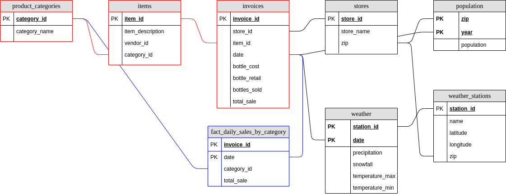

# Udacity Data Engineering Nanodegree

# Project: Data Warehouse

This project explores the use of AWS' managed Postgres and Redshift database services with the objective of better understanding how they both behave for OLTP (regularly loading new data into a source of truth database) and OLAP (extracting insights that may span multiple tables) workflows, and how table structure affects overall productivity.  This is examined using [Iowa liquor sales data](https://data.iowa.gov/Sales-Distribution/Iowa-Liquor-Sales/m3tr-qhgy) joined with [NOAA weather data](https://www.ncdc.noaa.gov/cdo-web/) and [US population data](https://www.kaggle.com/census/us-population-by-zip-code), where a few sample use cases are examined, such as investigating monthly liquor sales by store or the relation between liquor sales and weather patterns (such as snowfall and rainfall).  In particular, this will be explored from the perspective of two users, one who needs a source of truth (must have access to in-sync data, although this access need not be fully performant and could be infrequent) and one who needs analytics workflows (such as for a dashboard or machine learning use cases).

# Data Sources and Exploration

The data used here are:

* Iowa Liquor Sales
* National Oceanic and Atmospheric Administration weather data
* US census data for population

The exploration of these datasets is described below.

## Iowa Liquor Sales:

The [Iowa Liquor sales data](https://data.iowa.gov/Sales-Distribution/Iowa-Liquor-Sales/m3tr-qhgy) includes per-sale invoice records for liquor sales across Iowa, including the item sold, location sold from, and value of sale.  The data spans sales from 2012 to 2018 and is accessible through CSV download or interaction with the Socrata API.  The API has been used here, automated through scripts that request monthly data.  Initial data exploration was done using a subset of the data to estimate types/sizes, then these estimates were used to ingest the entire dataset.  

Key data fields include:

* invoice_id: unique, constant 16 character length, and does not contain nulls
* date: ranges from 2012-01 to 2018-04 and does not contain nulls
* store id: 4 digit ID and does not contain nulls 
* store zip code: 5 digit ID and does not contain nulls
* item category id: 9 digit numeric ID and and contains nulls
* category name: <50 character text field that contains nulls
* bottle cost, bottle retail, and total sale value: numeric and may contain nulls.  Staged as text to avoid rounding and to allow their final destination to choose precision

The staged raw CSV and parquet data are hosted publicly in `s3://udacity-de-capstone-182/raw-data/sales/`.

Note also that some fields which have ID and name components (for example, category id and category name) do not necessarily have the same unique counts.  Their definitions have changed over time (for example, Category ABC might be renamed to Category XYZ, but still use the same ID=1).  Because of this the strategy used here is to resolve any conflicts between ID and name by using the most recent naming convention from the raw data (for example, if in 2012 Category 1 had name ABC but in 2018 Category 1 had name XYZ, we use XYZ).

## National Oceanic and Atmospheric Administration weather data:

The [National Oceanic and Atmospheric Administration weather data](https://www.ncdc.noaa.gov/cdo-web/) includes daily weather summaries from all weather stations in the state of Iowa, including latitude/longitude of the station and the daily precipitation and snowfall totals for that location.  This data was obtained by manual request from the source as yearly CSV files and loaded into S3 manually. 

Key data fields include:
* weather station id: 11 character unique station ID that does not contain nulls
* date: collected for 2012-2018, does not contain nulls
* weather station latitude and longitude: described as a point
* daily precipitation: decimal value, may contain nulls
* daily snowfall: decimal value, may contain nulls

The staged raw CSV data is hosted publicly in `s3://udacity-de-capstone-182/raw-data/weather/`.

## US Census Data for Population

[US population data](https://www.kaggle.com/census/us-population-by-zip-code) was obtained from the US census via Kaggle and includes.  This dataset includes total population by zipcode, as well as broken down by zip code and demographics (age groups and gender).  Files were obtained for the 2000 and 2010 census, although currently only 2010 population is used.

Key data fields include:
* zipcode: 5 digit ID and does not contain nulls
* population: integer number of persons in the zip code and does not contain nulls
* other demographics, which here were used simply to filter for total population in an area

The staged raw CSV data is hosted publicly in `s3://udacity-de-capstone-182/raw-data/population/`.

# Database Infrastructure

Managed Postgres and Redshift implementations from AWS were examined here.  As they're provisioned differently (Redshift is managed on a set of nodes, whereas Postgres is essentially managed on a provisioned EC2 node), the choice was made to compare two solutions that have roughly the same monthly cost.  A single dc2.large node for Redshift is compared here to a db.m5.xlarge node for Postgres.

# ETL Strategy

The same ETL process was applied for both Postgres and Redshift implementations.  This process took the following steps:

* Store raw data:
    * (by human interaction): Transfer NOAA Iowa weather data for 2012-2018 to AWS S3, stored as yearly CSV files
    * (by human interaction): Transfer US population data for 2000 and 2010 to AWS S3, stored as yearly CSV files
    * (`get_sales_data.py`): Collect Iowa Liquor Sales data from Socrata API and transfer to AWS S3, grabbed and stored as monthly CSV and parquet files
* Stage raw data in staging tables:
    * (`create_tables.py`): (Drop and) Create all staging, OLTP, and OLAP tables
    * (`etl.py`): Load staging data from S3 CSV to database
* Copy staged data to OLTP tables:
    * (`etl.py`): Select/insert data from staging tables into OLTP tables in the schema described below
    * (`etl.py`): Enrich weather station data by adding zip code, computed using the `uszipcode` zip code search engine
* (`etl.py`): Copy OLTP data to OLAP schemas:
 
# Analytics objectives

In general, the objectives of the analytical workflow here are to flexibly derive insights from the sales, weather, and population data provided.  As an example of these goals, three primary use cases were examined.  These were chosen to investigate different workloads (from spanning the entire database to aggregating smaller portions of the data).  The use cases are: 

1. Aggregating sales per category and relating it to weather and population data (for example, how do the per-capita sales of liquor category X compare to category Y on days with high snowfall).
1. Aggregating monthly sales per store
1. Aggregating daily sales per category across all stores

# Database Schema

## OLTP Schema

The OLTP database had the following schema:


The database centers on a the invoice table which includes transaction data (`bottle_cost`, `total_sale`) and references to other tables for store and item details.  The goal here is a Third Normal Form schema with no redundancy, but this causes complications when trying to relate properties like an item category with the store that sells it as they require multiple joins.  In the case of aggregating liquor sales by category and comparing to weather data, five joins are required.

## OLAP Schemas

To optimize performance for the target workloads, the following OLAP schemas were also investigated. 

### Per Category Sales vs Weather and Population

This use case spans the entire OLTP schema, relating product category to weather and population, and is thus expected to benefit significantly from a denormalized OLAP table which reduces the `join` workload.  For example, in the OLTP schema relating invoices to weather requires four joins and relating invoices to product categories requires two joins in the opposite direction.  To aggregate per-category sales and compare them to weather and population in the OLTP schema requires five joins.  

An OLAP schema around a single denormalized fact table was investigated as shown below.  This schema would let a user view per-category_id sales vs weather and population without a single join, and minimal additional joins for the normalized columns such as category_name or store_name.


### Daily Sales per Category

This use case requires a single `join` and `group by` to be performed when using the OLTP database directly.  It is expected that an OLAP table could improve on the responsiveness of this query by storing these results.  An example of the schema is shown below. 



### Monthly Aggregate Sales per Store

This use case requires no `join`s but does require a `group by` over a large table.  It is expected that the use case could benefit from an aggregation OLAP table that caches the work of the `group by` operation, although perhaps less so than use cases that require many joins.  An example of the schema is shown below. 


# Table Optimization

Table optimizations attempted here included:

* Adding distribution styles to Redshift tables (`ALL` for all small dimension tables, `EVEN` for staging tables).  

Staging tables distributed even
dimensions for olap dist all

TODO?
**NOTES: make suer you check these for full db**

* add indices for key table/query?  For example:
    * `explain analyze select * from population order by zipcode;`: 
        * No index: 260ms
        * `create index population_ind_zipcode ON population(zipcode);`: 94ms
        * `create index population_ind_zipcode ON population(zipcode, population);`: 94ms  <-this way we don't need to scan to get population
    * `olap_fact_sales_weather_population_by_year`:
        * No index: 17ms
        * `CREATE INDEX olap_swp_year ON fact_sales_weather_population(EXTRACT (YEAR FROM date));`: 0.06ms
    ``

**TODO: SEE THIS IN OTHER REPORTS**

# Repository Contents and Run Instructions

Included in the repository are:

* `get_sales_data.py`: Fetches monthly sales data from public API and store in S3
    *  see `-h` for more details
    *  example: `python get_sales_data.py 2012-01 2018-12 --data_spec sales_raw`
* `create_tables.py`: (Drops and) Creates tables for the database
    *  see `-h` for more details
    *  example: `python create_tables.py --db postgres`
* `etl.py`: Performs ETL from raw --> staged --> OLTP database
    *  see `-h` for more details
    *  example: `python etl.py --db postgres`
* `etl_olap.py`: Performs ETL from OLTP --> OLAP
    *  see `-h` for more details
    *  example: `python etl_olap.py --db postgres`
* `sql_queries.py`: Definitions of all SQL queries 
* `utilities.py`: Shared utilities used throughout the code
* `data.yml`: Definition of metadata for the data sources
* `secrets.yml`: Not included in the repository, but should contain data of the form:
    ````yaml
    postgres:
        database:
        host:
        port:
        user:
        password:
        setup_commands:
        - CREATE EXTENSION aws_s3 CASCADE
    
    aws:
        access_key:
        secret_key:
    
    redshift:
        database:
        host:
        port:
        user:
        password:
        arn:
    
    socrata:
        access_key:
        secret_key:
    ````

# Discussion on Performance

## ETL Performance

The staging of raw data, specifically the many sales data files, in Redshift was notably better performing than in Postgres:

* Postgres:
    * Staging (~155s total):
        * Staging sales files consistently took ~2s per file, with no reduction of performance as the size of staged data grew
        * staging time for other data (population and weather) was small relative to that of sales.  Staging all other data took ~12s total
    * Insert of staged data into OLTP schema took about 580s
    * Insert of OLTP data into OLAP schema took about 460s
* Redshift:
    * Staging (~180s total)
        * Staging sales files consistently took ~2s per file, with no reduction of performance as the size of staged data grew
        * Staging other files took ~20s total.
    * Insert of staged data into OLTP schema took about 70s
    * Insert of OLTP data into OLAP schema took about 20s total (mostly for the large weather/population/sales table)

**TODO: COmment**

## Analytics Performance

Query performance was timed by rerunning the same queries multiple times and taking the average.  Throughout the tests there was significant variation - average values are shown here.

|                                                          | Postgres | Postgres | Redshift | Redshift |
|---------------------------------------------------------:|---------:|---------:|----------|----------|
|                                                          | OLTP     | OLAP     | OLTP     | OLAP     |
|            Monthly Aggregate Sales per Store             |          |          | 6        | 5        |
|                     Daily Sales per Category             |          |          | 5        | 2        |
| Per Category Sales vs Weather and Population             | 550      | 145      | 130      | 120      |
| Per Category Sales vs Weather and Population (2015 only) | 235      |          | 73       | 25       |

**TODO:**

# Project Questions:

## Clearly state the rationale for the choice of tools and technologies for the project.

The database tools were chosen here to compare two similar but different managed database solutions that could be loaded using a similar ETL and support transactional and analytics queries.  Redshift and Postgres were chosen because the scale of the data was modest (large enough to need structured storage and access, but not large enough to require a big data solution like Spark for most analytic workloads), and because qualitatively they should have different strengths and weaknesses (for example, Redshift is columnar and well suited for analytics at scale whereas postgres is row-oriented and may work better in OLTP workloads).

## Propose how often the data should be updated and why.

Given the nature of the data sources, the current system need only be updated whenever new liquor sales data is added to the database (current dissemination of data lags by ~2 years).  If this was an in-house data source that had frequent updates, the answer to this would depend on what the usage of the data required.  If this was used to provide frequent summary of the sales, etc., ETL of new data would need to be at least as frequent as the analyses (if analysis is daily, ETL needs to be <= daily).    

## Write a description of how you would approach the problem differently under the following scenarios:

### The data was increased by 100x.

The present ETL process (staging all data into a single staging table then selecting the data into the OLTP/OLAP schemas) will not scale 100x.  This process worked but was cumbersome even in the present study, especially for initial postgres implementations that used an undersized compute node that led to significantly decreasing performance for staging data as the staging table grew.  In the case of 100x scale, it is expected that at least the Postgres implementation would have trouble staging that size data at once.  It would make more sense to stage the data in chunks (stage file 1, load file 1 into OLTP; stage file 2, load file 2 into OLTP; ...).  This workload would lend itself well to a more formalized data pipeline using airflow.

In general, Redshift has been designed with scale in mind more than Postgres has.  Although Postgres does have features for scale and parallelism, those features are more core to Redshift's design.  Redshift as a managed service is also easier to scale without interuption (by adding/modifying the nodes).  It is expected that at 100x scale Redshift would perform much better than Postgres for the same workloads.  

Analytics workloads may also be problematic at 100x scale, depending on the type of analytics that were being performance.  Although some analytics may still be feasible, a big data solution such as Spark with distributed data might serve the needs better.  Distributed data with a simple data access layer (such as S3 storage of parquet files with AWS Athena on top) might also suit the needs well, especially if infrequent access is required as Athena provides a serverless solution that would not require always-on managed instances.  

Whether using distributed data or RDS, more focus on partitioning and indexing data would be beneficial at larger scale.  

### The data populates a dashboard that must be updated on a daily basis by 7am every day.

Regularly scheduled workloads such as this would benefit from using Airflow or other orchestration tools as they could manage the scheduled and time-sensitive nature of this sort of work.  For most dashboard support (queries that select a few columns but many rows) it is expected that Redshift would be better suited than Postgres as it is columnar in nature.

### The database needed to be accessed by 100+ people.

To support 100+ users (for example many users of a dashboard or many analytics users requiring data access), a horizontally scaling solution would be beneficial.  Some possibile solutions are: 

* Scaling a Redshift solution to multiple nodes.  This may be suitable depending on the scale, and could benefit from data replication (multiple nodes have the same data, reducing bottlenecks)
* Using a more distributed data storage solution, such as a data access layer (for example Spark or Amazon Athena) on top of files in S3 storage (parquet, compressed csv, etc.).  This would also be well suited for less structured data.  

# Recommendations and Conclusions

In general, the OLTP queries performed well for queries that required few joins (monthly and daily sales queries), but performed poorly for queries that spanned the entire database with multiple joins.  If these broad queries are frequent, the addition of the OLAP schema would be helpful.

The Redshift solution presented here appears better suited to the task and scale at hand.  Analytics queries, both for OLAP and OLTP, performed better with Redshift than the Postgres implementation.  Additional optimizations to improve the Postgres setup, but they would need to be significant to overcome the observed performance deficits versus Redshift.  

It is also clear that the larger analytics jobs, such as the sales vs weather/population, are not suited to serve a dashboard or fast-response request.  Caching, better indexing/distribution strategies, or additional resources would be required to improve their performance.   
